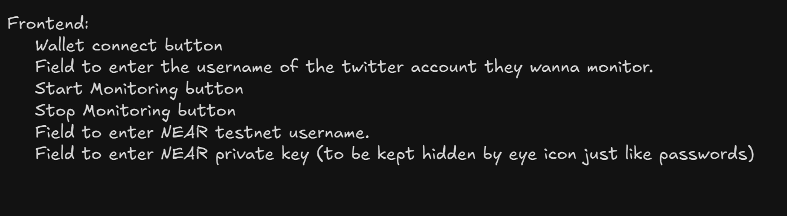

# 🚀 Twitter-Powered Meme Coin Trading Bot on NEAR

## 📌 Problem Statement
In the fast-moving world of **meme coins**, influencers and celebrities often drive token prices by tweeting about them. Traders who react quickly to these tweets can capitalize on price swings, but manually monitoring Twitter and executing trades is inefficient and slow.

Currently, most automated trading bots focus on **Solana (Pump.fun, Jupiter DEX)**, but **there is no such automated system for NEAR Protocol**.

### 🔴 Challenges
- Manually monitoring influencer tweets for meme coins is slow and inefficient.
- Executing trades manually means missing out on early price movements.
- Existing solutions primarily work on **NEAR**.

---

## 💡 Solution: Automated AI Trading Bot on NEAR
This bot **automatically monitors Twitter** for influential tweets mentioning meme coins, extracts the token details, verifies if the token is a **valid NEAR asset**, and automatically purchases it via **Ref Finance (NEAR DEX)**.

### ✅ How It Works
1. **Monitor Twitter:** Uses AI to track tweets from influencers (like Elon Musk, Donald Trump, crypto KOLs).
2. **Extract Token Information:** Extracts the token name, contract ID, or symbol from the tweet.
3. **Verify Token on NEAR:**
   - Ensures the token is on **NEAR Protocol** (not Ethereum or Solana).
   - Calls the NEAR blockchain to verify it's a **valid NEP-141 token**.
4. **Buy Token on NEAR DEX (Ref Finance):**
   - Executes a swap from **NEAR → Meme Coin** using Ref Finance’s smart contract.
   - Ensures slippage protection.
5. **Repeat Process:** Continuously listens for new tweets and executes trades automatically.

---

## 🛠️ Technology Stack
- **Blockchain:** NEAR Protocol
- **DEX:** Ref Finance
- **Programming Language:** TypeScript, Nodejs
- **Twitter API:** Fetches influencer tweets
- **NEAR API:** `near-api-js` for transaction execution
- **RPC Provider:** `https://rpc.testnet.near.org`

---

---

## 🤝 Contributing
If you'd like to contribute, feel free to submit a pull request or open an issue! 🚀

---

## 📜 License
This project is **open-source** under the MIT License.

